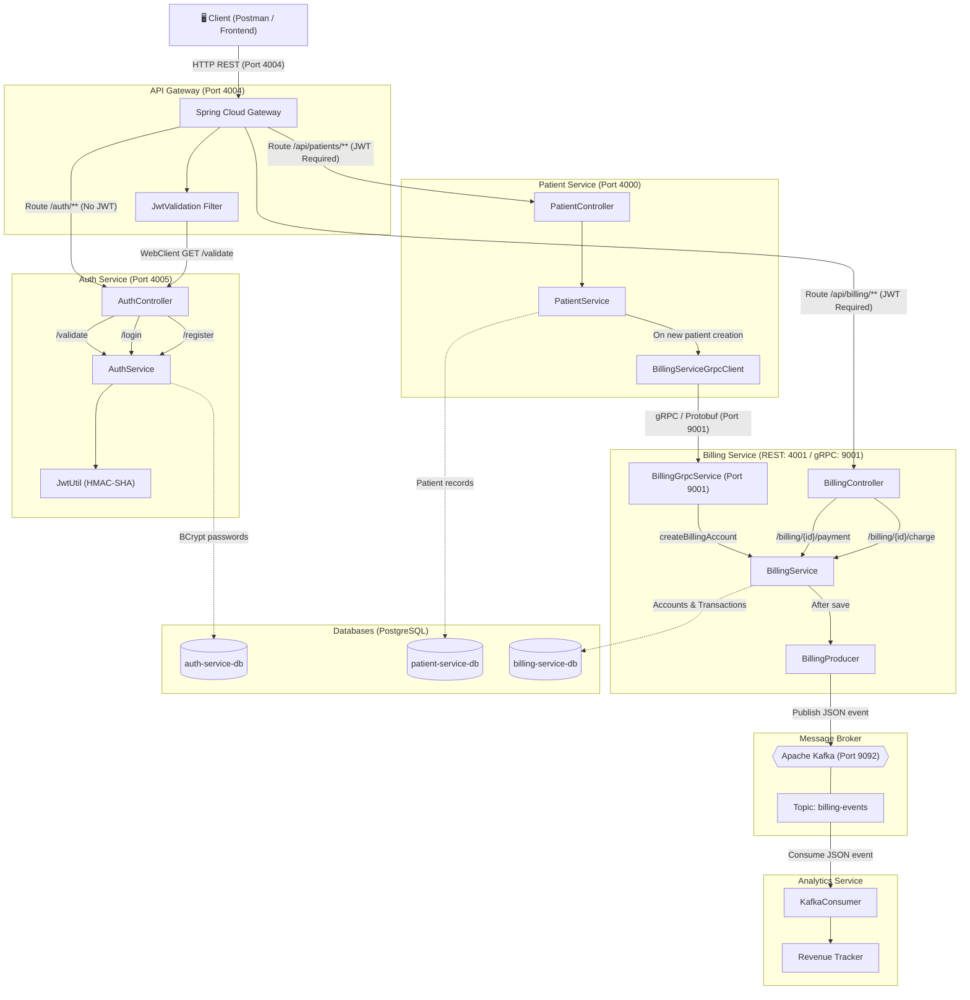

# 🏥 Patient Management Microservices System

A robust, enterprise-grade distributed system built with Spring Boot to handle hospital patient registration, billing, and analytics. This project demonstrates a highly scalable microservices architecture utilizing modern communication protocols, event-driven design, and strict security measures.

## 🚀 Tech Stack

*   **Backend:** Java 21, Spring Boot 3.x
*   **Routing & API Gateway:** Spring Cloud Gateway, Spring WebFlux
*   **Security:** Spring Security, JSON Web Tokens (JWT), BCrypt
*   **Synchronous Communication:** gRPC (Protobuf)
*   **Asynchronous Communication (Event-Driven):** Apache Kafka
*   **Database:** PostgreSQL, Spring Data JPA
*   **Containerization:** Docker, Docker Compose

---

## 🏗️ Architecture Overview

The system consists of 5 decoupled microservices, an API Gateway, and necessary infrastructure containers (Kafka, PostgreSQL).




1.  **API Gateway (`api-gateway`)**
    *   The single entry point for all client requests.
    *   Intercepts requests and validates JWT tokens securely without exposing internal services.
2.  **Auth Service (`auth-service`)**
    *   Manages user registration and password hashing (BCrypt).
    *   Generates cryptographically signed JWTs upon successful login.
3.  **Patient Service (`patient-service`)**
    *   Handles patient records and demographic data.
    *   Initiates **gRPC** calls to the Billing Service the exact moment a new patient is registered to automatically create their billing account.
4.  **Billing Service (`billing-service`)**
    *   Manages patient accounts, charges, and payments.
    *   Exposes a gRPC server to securely listen to the Patient Service.
    *   Acts as a **Kafka Producer**: Publishes JSON `billing-events` whenever financial transactions occur.
5.  **Analytics Service (`analytics-service`)**
    *   Acts as a **Kafka Consumer**.
    *   Listens to the `billing-events` topic asynchronously to track and calculate total hospital revenue in real-time.

---

## 🔐 Security Flow (JWT)

1.  User registers/logs in via `POST /auth/login`.
2.  Auth Service returns a signed JWT.
3.  User sends request to `GET /api/patients/{id}` with `Authorization: Bearer <token>`.
4.  API Gateway intercepts the request and makes an internal WebClient call to the Auth Service to validate the signature.
5.  If valid, the request is routed to the target microservice. If invalid, the Gateway gracefully rejects it with `401 Unauthorized`.

---

## 🏃‍♂️ How to Run Locally

### Prerequisites
*   Java 21 installed
*   Maven installed
*   Docker & Docker Compose installed

### Steps
1.  **Start the Infrastructure:**
    Ensure Docker is running, then spin up the databases and Kafka:
    ```bash
    docker-compose up -d
    ```
2.  **Run the Microservices:**
    You can run each service individually via your IDE, or build and run them via Docker if configured. Ensure environment variables (like `JWT_SECRET` and Database URLs) are configured in your run configurations.

---

## 🎯 Key Features & Learning Outcomes
*   **Eliminated REST Bottlenecks:** Replaced standard HTTP calls with **gRPC** for lightning-fast internal communication between Patient and Billing services.
*   **Decoupled Services:** Prevented cascading failures by utilizing **Kafka** to handle analytics processing asynchronously.
*   **Centralized Security:** Removed security logic from business microservices by enforcing JWT validation at the **API Gateway** level using Reactive WebFlux.
*   **Avoided Infinite Recursion:** Handled complex JPA Bidirectional relationships (`@ManyToOne` / `@OneToMany`) safely when serializing DTOs for Kafka.
